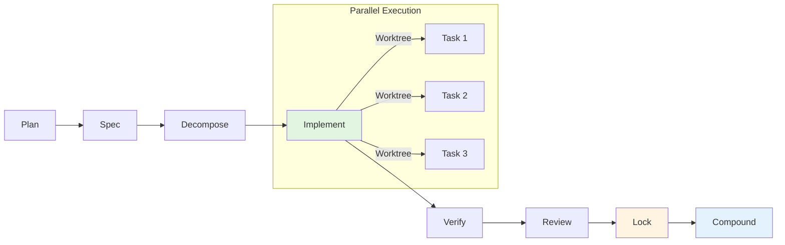

# CodeFoundry

[](https://github.com/mhingston/codefoundry)
[](https://github.com/mhingston/codefoundry)
[](https://golang.org)
[](LICENSE)

**Deterministic workflows for AI-assisted software development with fail-closed quality gates.**

CodeFoundry brings engineering rigor to AI coding by enforcing protocol-defined workflows, deterministic execution, and machine-checkable quality gates—preventing bad code from reaching production while maintaining development velocity.

---

## The Problem

AI coding assistants are powerful but unpredictable:

- **Quality varies**: Same prompt produces different code quality each time
- **No reproducibility**: Can't replay or verify what the AI actually did
- **No quality gates**: Code goes straight to PR without systematic review
- **No audit trail**: Hard to track what was changed and why
- **Integration friction**: Each AI tool (Copilot, Claude, Codex) works differently

**Traditional AI coding** = Prompt → Code → Hope it works

**CodeFoundry** = Protocol → Deterministic workflow → Quality gates → Evidence

---

## The Solution

CodeFoundry is a **protocol-first software factory** that orchestrates AI-assisted development with determinism guarantees:

- **Protocol-defined workflows**: YAML files define stages, gates, and quality criteria
- **Deterministic execution**: Same inputs always produce identical outputs
- **Fail-closed quality gates**: Uncertainty defaults to safe state (reopen, not resolved)
- **Machine-checkable contracts**: Every stage produces validated artifacts
- **Harness-agnostic**: Works with OpenCode, Claude Code, Copilot, Codex, etc.
- **Full audit trail**: Complete evidence bundle for compliance

---

## Quick Start

```bash
# Install
go install github.com/mhingston/codefoundry/cmd/codefoundry@latest

# Initialize project
codefoundry init
# Creates .codefoundry/ directory structure

# Define your first protocol
cat > .codefoundry/protocols/quickstart.yaml << 'EOF'
name: "quickstart"
version: "1.0.0"

stages:
  - id: plan
    name: "Plan"
    template: plan.md
    outputs: [plan.md]
    
  - id: implement
    name: "Implement"
    template: implement.md
    depends_on: [plan]
    inputs: [plan.md]
    outputs: ["**/*.go"]
    
  - id: verify
    name: "Verify"
    depends_on: [implement]
    gates: [build, test]
    outputs: [verify-report.json]

gates:
  - id: build
    command: "go build ./..."
    required: true
    timeout: 60
    
  - id: test
    command: "go test ./..."
    required: true
    timeout: 120
EOF

# Run the workflow
codefoundry run

# Check status
codefoundry status
# Shows: plan [✓] → implement [✓] → verify [✓]

# Generate evidence bundle
codefoundry bundle
# Creates evidence.zip with all artifacts, gate reports, and audit trail
```

---

## How It Works



**Stages:**
1. **Plan** - Define scope, risks, acceptance criteria
2. **Spec** - Technical specification with assumptions
3. **Decompose** - Break into executable tasks (tasks.yaml)
4. **Implement** - Execute tasks in isolated worktrees (parallel)
5. **Verify** - Run quality gates (lint, test, typecheck)
6. **Review** - AI-powered review with rubric scoring
7. **Lock** - Fail-closed decision (resolved/reopen)
8. **Compound** - Extract learnings, update metrics

---

## Key Features

### 📝 Protocol-First Workflows

Define workflows in YAML, version control them, reproduce anytime:

```yaml
stages:
  - id: implement
    type: task_prompt
    parallel: true
    worktree_strategy: fail
    hooks:
      pre_subagent:
        - type: api
          url: "http://localhost:8081/hooks/pre-task"
```

**Why it matters**: Workflows as code—reviewable, versionable, reproducible.

### 🎯 Deterministic Execution

Same inputs → Same outputs. Always.

```bash
# Run once
codefoundry run

# Replay to verify determinism
codefoundry replay verify <run-id>

# Check for flakes (run 5 times, expect 95%+ consistency)
codefoundry flake detect <run-id> --replays 5 --threshold 0.95
```

**Why it matters**: You can trust that what worked once will work again.

### 🔒 Fail-Closed Quality Gates

Gates run automatically. If uncertain, fail safe.

```yaml
gates:
  - id: security
    command: "npm audit --audit-level=high"
    required: true
    
  - id: coverage
    command: "go test -cover ./... | grep -E 'coverage: [0-9]+'"
    required: true
```

**Logic:**
- Required gate fails → Stage fails → Workflow pauses
- Confidence < threshold → Escalates to human
- P1 findings exist → Must fix before resolved

### 🔌 External Harness Integration

Use your preferred AI tool—CodeFoundry provides the backbone.

**Supported:**
- OpenCode (in-process JS/TS plugins)
- GitHub Copilot SDK (multi-language via JSON-RPC)
- OpenAI Codex (TypeScript SDK)
- Claude Code (terminal-based)
- **Any** tool with HTTP hooks

**Integration pattern:**
```yaml
hooks:
  pre_subagent:
    - type: api
      url: "http://localhost:8081/hooks/spawn"
      # Your harness implements this endpoint
```

**Why it matters**: Keep your existing tools, add determinism and gates.

### 📊 Evidence & Audit Trail

Every run produces a complete evidence bundle:

```bash
codefoundry bundle

# Creates:
# evidence/
# ├── status.json           # Run status
# ├── gate-reports/         # All gate results
# │   ├── lint.json
# │   └── test.json
# ├── review/
# │   └── review-report.json
# ├── lock/
# │   └── lock-decision.json
# └── metadata.json         # Run metadata
```

**Why it matters**: Complete audit trail for compliance, debugging, and metrics.

---

## Example: Complete Protocol

Here's a production-ready protocol with all features:

```yaml
name: "feature-development"
version: "2.0.0"
description: "Full development workflow with review and gates"

stages:
  - id: plan
    name: "Plan"
    template: plan.md
    outputs: [plan.md]
    
  - id: spec
    name: "Specification"
    template: spec.md
    depends_on: [plan]
    inputs: [plan.md]
    outputs: [spec.md]
    
  - id: decompose
    name: "Decompose"
    template: decompose.md
    depends_on: [spec]
    inputs: [spec.md]
    outputs: [tasks.yaml]
    
  - id: implement
    name: "Implement"
    type: task_prompt
    source: decompose
    depends_on: [decompose]
    parallel: true
    worktree_strategy: fail
    max_concurrent: 5
    hooks:
      pre_merge:
        - type: api
          url: "http://localhost:8081/hooks/security-check"
          timeout: 60
    outputs: ["*/task-report.json"]
    
  - id: verify
    name: "Verify"
    depends_on: [implement]
    gates: [lint, typecheck, test, security]
    outputs: [verify-report.json]
    
  - id: review
    name: "Review"
    template: review.md
    depends_on: [verify]
    inputs: [verify-report.json]
    outputs: [review-report.json]
    
  - id: lock
    name: "Lock"
    type: decision
    depends_on: [review]
    outputs: [lock-decision.json]
    
  - id: compound
    name: "Compound"
    template: compound.md
    depends_on: [lock]
    condition: "lock.decision == 'resolved'"
    outputs: [solution.md]

gates:
  - id: lint
    name: "Lint"
    command: "golangci-lint run"
    required: true
    timeout: 120
    
  - id: typecheck
    name: "Typecheck"
    command: "go vet ./..."
    required: true
    timeout: 60
    
  - id: test
    name: "Test"
    command: "go test -cover ./..."
    required: true
    timeout: 300
    
  - id: security
    name: "Security Scan"
    command: "gosec ./..."
    required: false
    timeout: 120
```

---

## CLI Reference

```bash
# Workflow commands
codefoundry init                          # Initialize project
codefoundry run [stage]                   # Run workflow (or specific stage)
codefoundry status                        # Show current status
codefoundry complete <stage> <artifacts>  # Mark stage complete

# Quality commands  
codefoundry gate <gate-id>                # Run specific gate
codefoundry review [stage]                # Execute review stage
codefoundry lock                          # Evaluate lock decision

# Evidence commands
codefoundry bundle [run-id]               # Export evidence bundle
codefoundry report [run-id]               # Generate report

# Determinism commands
codefoundry replay record                 # Start recording
codefoundry replay verify <run-id>        # Verify determinism
codefoundry flake detect <run-id>         # Detect flaky tests

# Analysis commands
codefoundry metrics generate              # Weekly metrics
codefoundry metrics trend                 # Trend analysis
codefoundry golden audit                  # Audit against principles

# Development commands
codefoundry validate <protocol>           # Validate protocol YAML
codefoundry ci init --provider github     # Generate CI workflow
```

---

## When to Use CodeFoundry

✅ **Use when:**
- Building multi-stage AI workflows (plan → spec → implement → review → lock)
- Need reproducibility and determinism
- Require quality gates before code reaches production
- Supporting multiple AI tools (want harness-agnostic solution)
- Need audit trail and compliance evidence
- Team is doing AI-assisted development at scale

❌ **Don't use when:**
- One-off AI tasks (use the harness directly)
- Prototype/MVP phase (too much ceremony)
- Single-harness solution works fine
- No need for reproducibility
- Team size is 1-2 developers

---

## Comparison

| Aspect | CodeFoundry | Factorial | SpecFirst |
|--------|-------------|-----------|-----------|
| **Orchestration** | Protocol-first (YAML) | DOT-based (Graphviz) | Prompt-only |
| **Determinism** | ✅ Yes | ✅ Yes | ❌ No |
| **Quality Gates** | ✅ Fail-closed | ✅ Yes | ❌ No |
| **Execution** | External harness | Self-contained | External harness |
| **Language** | Go (fast CLI) | TypeScript | Go |
| **Worktrees** | ✅ Native | ✅ Yes | ❌ No |
| **Parallel Tasks** | ✅ Yes | ✅ Yes | ❌ No |
| **Review/Rubric** | ✅ Yes | ✅ Yes | ❌ No |
| **Lock Decision** | ✅ Yes | ✅ Yes | ❌ No |
| **Best For** | Production workflows | Complex graphs | Simple prompting |

**Recommendation:**
- **CodeFoundry**: Production AI workflows needing determinism and gates
- **Factorial**: Complex visual workflows, comfortable with Graphviz
- **SpecFirst**: Simple prompt generation without execution rigor

---

## Documentation

- **[Handoff Document](codefoundry-handoff.md)** - Complete architecture and implementation spec
- **[Architecture](docs/architecture.md)** - System design and component interactions
- **[Contracts](docs/contracts.md)** - Machine-checkable JSON schemas
- **[Integration](docs/integration.md)** - Harness integration guide
- **[Hooks](docs/hooks.md)** - Event-driven customization

---

## Development

```bash
# Clone
git clone https://github.com/mhingston/codefoundry.git
cd codefoundry

# Dependencies
go mod download

# Build
go build ./cmd/codefoundry

# Test (90%+ coverage)
go test -cover ./...

# Lint
golangci-lint run

# Run locally
go run ./cmd/codefoundry
```

### Project Structure

```
codefoundry/
├── cmd/codefoundry/       # CLI entry point
├── internal/
│   ├── protocol/           # YAML protocol loading
│   ├── stage/            # Stage execution engine
│   ├── gate/             # Quality gates
│   ├── worktree/         # Git worktree management
│   ├── subagent/         # Subagent orchestration
│   ├── review/           # Rubric-based review
│   ├── lock/             # Lock decision evaluator
│   ├── report/           # Evidence generation
│   ├── replay/           # Determinism verification
│   ├── flake/            # Flake detection
│   ├── metrics/          # Compound metrics
│   ├── ci/               # CI integration
│   └── golden/           # Pattern enforcement
├── docs/                  # Documentation
├── schemas/               # JSON schemas
└── templates/             # Stage templates
```

---

## Contributing

1. Fork the repository
2. Create a feature branch (`git checkout -b feature/amazing-feature`)
3. Make changes with tests (90%+ coverage)
4. Run tests (`go test ./...`)
5. Commit changes (`git commit -m 'Add amazing feature'`)
6. Push to branch (`git push origin feature/amazing-feature`)
7. Open a Pull Request

See [CONTRIBUTING.md](CONTRIBUTING.md) for detailed guidelines.

---

## License

MIT License - see [LICENSE](LICENSE) file for details.

---

## Support

- GitHub Issues: [mhingston/codefoundry](https://github.com/mhingston/codefoundry/issues)
- Documentation: [docs/](docs/)
- Discussions: [GitHub Discussions](https://github.com/mhingston/codefoundry/discussions)

**Built with ❤️ by the CodeFoundry team.**
